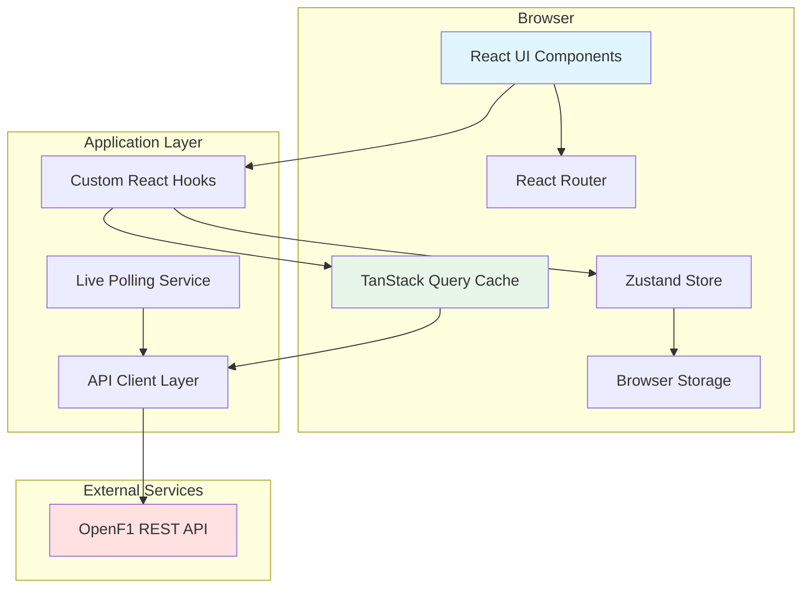
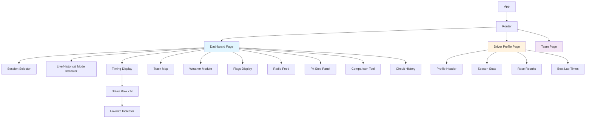

# Technical Design Document

## Overview

The OpenF1 Dashboard is a single-page web application built with Vite, TypeScript, and React that provides real-time and historical Formula 1 data visualization. The application consumes the OpenF1 REST API (https://api.openf1.org/v1) to display live timing, driver information, telemetry, weather, and race control data in a responsive and intuitive interface.

### Design Goals

1. **Real-time Updates**: Efficient polling and update mechanisms for live session data
2. **Responsive Performance**: Fast load times through caching and optimized rendering
3. **Modular Architecture**: Component-based design for maintainability and extensibility
4. **Type Safety**: Comprehensive TypeScript types for all API responses and application state
5. **User Experience**: Clear loading states, error handling, and device responsiveness

### Technology Stack

- **Build Tool**: Vite 5.x (fast development and optimized production builds)
- **Language**: TypeScript 5.x (type safety and developer experience)
- **UI Framework**: React 18.x (component architecture and hooks)
- **State Management**: TanStack Query (React Query) for server state, Zustand for client state
- **Routing**: React Router v6 (declarative routing for SPA navigation)
- **Styling**: Tailwind CSS (utility-first styling with responsive design)
- **Charts/Visualization**: Recharts (telemetry and timing charts)
- **HTTP Client**: Axios (API communication with interceptors)
- **Testing**: Vitest (unit tests) + Testing Library (component tests) + fast-check (property-based tests)

### Key Technical Decisions

**Why TanStack Query?**
- Built-in caching, background refetching, and stale data management
- Automatic request deduplication and pagination support
- Perfect fit for the OpenF1 API's RESTful structure

**Why Zustand for Client State?**
- Lightweight alternative to Redux for UI state (favorites, filters, view preferences)
- Simple API with minimal boilerplate
- Excellent TypeScript support

**Why Recharts?**
- Declarative chart components that integrate seamlessly with React
- Sufficient for telemetry visualization needs (line charts, area charts)
- Good performance for the expected data volumes

## Architecture

### System Architecture



### Application Structure

```
src/
├── components/           # React components
│   ├── layout/          # Layout components (Header, Sidebar, Container)
│   ├── timing/          # Timing display components
│   ├── telemetry/       # Telemetry visualization components
│   ├── track-map/       # Animated track map
│   ├── weather/         # Weather module
│   ├── radio/           # Radio messages feed
│   ├── pit-stops/       # Pit stop analysis
│   ├── comparison/      # Driver comparison tool
│   ├── favorites/       # Favorites system components
│   ├── common/          # Shared components (Button, Card, LoadingSpinner, ErrorBoundary)
│   └── flags/           # Race flag indicators
├── pages/               # Page-level components
│   ├── Dashboard.tsx    # Main dashboard page
│   ├── DriverProfile.tsx
│   ├── TeamPage.tsx
│   └── NotFound.tsx
├── api/                 # API client and service layer
│   ├── client.ts        # Axios instance configuration
│   ├── endpoints.ts     # API endpoint definitions
│   └── services/        # Service modules per domain
│       ├── sessions.ts
│       ├── drivers.ts
│       ├── timing.ts
│       ├── telemetry.ts
│       ├── weather.ts
│       ├── flags.ts
│       ├── radio.ts
│       └── pit-stops.ts
├── hooks/               # Custom React hooks
│   ├── useSession.ts
│   ├── useDrivers.ts
│   ├── useTiming.ts
│   ├── useTelemetry.ts
│   ├── useWeather.ts
│   ├── useFlags.ts
│   ├── useRadio.ts
│   ├── usePitStops.ts
│   ├── useFavorites.ts
│   ├── useLivePolling.ts
│   └── useCircuitHistory.ts
├── stores/              # Zustand state stores
│   ├── favoritesStore.ts
│   ├── viewPreferencesStore.ts
│   └── sessionStore.ts
├── types/               # TypeScript type definitions
│   ├── api.ts           # API response types
│   ├── domain.ts        # Domain model types
│   └── ui.ts            # UI-specific types
├── utils/               # Utility functions
│   ├── formatting.ts    # Time, gap, and number formatting
│   ├── caching.ts       # Cache key generation and validation
│   ├── polling.ts       # Polling interval management
│   └── team-colors.ts   # Team color mappings
├── constants/           # Application constants
│   ├── api.ts           # API URLs, intervals, retry settings
│   ├── teams.ts         # Team data and colors
│   └── circuits.ts      # Circuit layout data
├── App.tsx              # Root application component
├── main.tsx             # Application entry point
└── router.tsx           # Route definitions
```

### Data Flow Patterns

**Historical Data Flow (Req 15)**:
1. User selects a session from the past
2. React Query checks cache for session data (5-minute TTL per Req 19)
3. If cache miss, fetch from OpenF1 API
4. Display data with "Historical Mode" indicator
5. No automatic refetching

**Live Data Flow (Req 2, 6, 7, 14)**:
1. User selects an active session
2. Application enters "Live Mode"
3. React Query fetches initial data
4. `useLivePolling` hook sets up interval-based refetching:
   - Timing, flags, positions: 2-second interval
   - Weather: 30-second interval
5. On each interval, React Query refetches with `staleTime: 0`
6. UI updates automatically via React Query's observer pattern
7. When session ends, polling stops automatically

**Cache Strategy (Req 19)**:
- Session metadata: 30-minute TTL
- Driver/team static data: 24-hour TTL
- Historical timing/telemetry: 5-minute TTL
- Live data: `staleTime: 0`, `cacheTime: 2 minutes`

## Components and Interfaces

### Core Component Hierarchy



### Key Component Interfaces

#### SessionSelector Component

**Responsibilities**: Displays available sessions, handles session selection (Req 1)

```typescript
interface SessionSelectorProps {
  selectedSessionKey: string | null;
  onSessionSelect: (sessionKey: string) => void;
}

// Uses useSession hook to fetch sessions
// Displays loading state while fetching (Req 18)
// Shows empty state if no sessions (Req 1.4)
// Highlights selected session
```

#### TimingDisplay Component

**Responsibilities**: Shows live/historical timing data with positions, gaps, and lap times (Req 2)

```typescript
interface TimingDisplayProps {
  sessionKey: string;
  isLiveMode: boolean;
  favoritesOnly?: boolean;
}

interface TimingRow {
  position: number;
  driverNumber: number;
  driverName: string;
  teamColor: string;
  gapToLeader: string;      // "+1.234" format
  gapToAhead: string;       // "+0.456" format
  lastLapTime: string;      // "1:23.456" format
  bestLapTime: string;      // "1:22.789" format
  isFastestLap: boolean;
  isImprovement: boolean;   // Highlight if improved
  isFavorite: boolean;
}
```

#### TrackMap Component

**Responsibilities**: Animated visualization of driver positions on circuit (Req 7)

```typescript
interface TrackMapProps {
  sessionKey: string;
  circuitKey: string;
  isLiveMode: boolean;
}

interface DriverPosition {
  driverNumber: number;
  x: number;                // Normalized 0-1000
  y: number;                // Normalized 0-1000
  teamColor: string;
}

interface CircuitLayout {
  circuitKey: string;
  pathData: string;         // SVG path data
  sectorBoundaries: number[]; // Percentage along track
}
```

#### TelemetryChart Component

**Responsibilities**: Visualizes car telemetry data (Req 5)

```typescript
interface TelemetryChartProps {
  sessionKey: string;
  driverNumber: number;
  lapNumber?: number;
}

interface TelemetryData {
  distance: number;         // Meters along lap
  speed: number;            // km/h
  throttle: number;         // 0-100%
  brake: number;            // 0-100%
  gear: number;             // 1-8
  rpm: number;
}
```

#### WeatherModule Component

**Responsibilities**: Displays current weather conditions (Req 14)

```typescript
interface WeatherModuleProps {
  sessionKey: string;
  isLiveMode: boolean;
}

interface WeatherData {
  airTemp: number;          // Celsius
  trackTemp: number;        // Celsius
  humidity: number;         // Percentage
  rainfall: boolean;
  windSpeed?: number;
  windDirection?: number;
}
```


#### FlagsDisplay Component

**Responsibilities**: Shows current race control flags (Req 6)

```typescript
interface FlagsDisplayProps {
  sessionKey: string;
  isLiveMode: boolean;
}

interface FlagStatus {
  flagType: 'green' | 'yellow' | 'red' | 'blue' | 'checkered' | 'vsc' | 'sc';
  sector?: number;          // For yellow flags
  driverNumber?: number;    // For blue flags
  message?: string;
}
```

#### RadioFeed Component

**Responsibilities**: Displays team radio messages (Req 9)

```typescript
interface RadioFeedProps {
  sessionKey: string;
  isLiveMode: boolean;
  driverFilter?: number;
}

interface RadioMessage {
  timestamp: string;
  driverNumber: number;
  driverName: string;
  message: string;
  audioUrl?: string;
}
```

#### PitStopPanel Component

**Responsibilities**: Pit stop analysis and ranking (Req 8)

```typescript
interface PitStopPanelProps {
  sessionKey: string;
}

interface PitStop {
  driverNumber: number;
  lapNumber: number;
  duration: number;         // Seconds with 3 decimals
  timestamp: string;
}
```

#### ComparisonTool Component

**Responsibilities**: Side-by-side driver comparison (Req 10)

```typescript
interface ComparisonToolProps {
  sessionKey: string;
  driver1Number: number | null;
  driver2Number: number | null;
  onDriverSelect: (slot: 1 | 2, driverNumber: number) => void;
}

interface ComparisonData {
  lapTimes: { lap: number; driver1: number; driver2: number }[];
  sectorTimes: { sector: number; driver1: number; driver2: number }[];
  speedTraps: { location: string; driver1: number; driver2: number }[];
}
```

#### DriverProfilePage Component

**Responsibilities**: Comprehensive driver information page (Req 4)

```typescript
interface DriverProfilePageProps {
  driverNumber: number;     // From route params
}

interface DriverProfile {
  driverNumber: number;
  fullName: string;
  teamName: string;
  nationality: string;
  championshipPosition: number;
  seasonPoints: number;
  careerPoints: number;
  seasonResults: RaceResult[];
  bestLapTimes: SessionLapTime[];
}
```

#### TeamPage Component

**Responsibilities**: Team information and performance (Req 12)

```typescript
interface TeamPageProps {
  teamName: string;         // From route params
}

interface TeamInfo {
  teamName: string;
  teamColors: { primary: string; secondary: string };
  championshipPosition: number;
  constructorPoints: number;
  drivers: { number: number; name: string }[];
}
```

#### CircuitHistory Component

**Responsibilities**: Historical performance at current circuit (Req 13)

```typescript
interface CircuitHistoryProps {
  circuitKey: string;
  teamFilter?: string;
  driverFilter?: number;
}

interface HistoricalRace {
  year: number;
  winner: { name: string; team: string };
  results: { position: number; driver: string; team: string }[];
  pitStopStrategy: { driver: string; stops: number[]; avgDuration: number }[];
}
```

## Data Models

### OpenF1 API Response Types

Based on the OpenF1 API documentation at https://openf1.org:


```typescript
// Session endpoint: /v1/sessions
interface SessionResponse {
  session_key: number;
  session_name: string;       // "Race", "Qualifying", "Practice 1", etc.
  session_type: string;
  date_start: string;         // ISO 8601
  date_end: string;           // ISO 8601
  gmt_offset: string;
  location: string;
  country_name: string;
  circuit_key: number;
  circuit_short_name: string;
  year: number;
}

// Drivers endpoint: /v1/drivers
interface DriverResponse {
  driver_number: number;
  full_name: string;
  name_acronym: string;       // e.g., "HAM", "VER"
  team_name: string;
  team_colour: string;        // Hex color without #
  country_code: string;       // ISO 3166-1 alpha-3
  headshot_url?: string;
  session_key: number;
}

// Position endpoint: /v1/position
interface PositionResponse {
  date: string;               // ISO 8601
  driver_number: number;
  position: number;
  session_key: number;
  x: number;                  // Normalized coordinate
  y: number;                  // Normalized coordinate
  z: number;                  // Normalized coordinate
}

// Laps endpoint: /v1/laps
interface LapResponse {
  date_start: string;
  driver_number: number;
  duration_sector_1: number | null;
  duration_sector_2: number | null;
  duration_sector_3: number | null;
  lap_duration: number | null;
  lap_number: number;
  is_pit_out_lap: boolean;
  session_key: number;
  segments_sector_1: number[];
  segments_sector_2: number[];
  segments_sector_3: number[];
}

// Intervals endpoint: /v1/intervals
interface IntervalResponse {
  date: string;
  driver_number: number;
  gap_to_leader: number | null;  // Seconds
  interval: number | null;        // Gap to car ahead in seconds
  session_key: number;
}

// Car data endpoint: /v1/car_data
interface CarDataResponse {
  date: string;
  driver_number: number;
  rpm: number;
  speed: number;
  n_gear: number;
  throttle: number;
  brake: number;
  drs: number;
  session_key: number;
}

// Weather endpoint: /v1/weather
interface WeatherResponse {
  date: string;
  air_temperature: number;
  humidity: number;
  pressure: number;
  rainfall: number;
  track_temperature: number;
  wind_direction: number;
  wind_speed: number;
  session_key: number;
}

// Race control endpoint: /v1/race_control
interface RaceControlResponse {
  date: string;
  category: string;           // "Flag", "SafetyCar", "Other"
  flag: string | null;        // "YELLOW", "RED", "GREEN", etc.
  lap_number: number | null;
  message: string;
  scope: string;              // "Track", "Sector", "Driver"
  sector: number | null;
  driver_number: number | null;
  session_key: number;
}

// Pit stops endpoint: /v1/pits
interface PitStopResponse {
  date: string;
  driver_number: number;
  lap_number: number;
  pit_duration: number;       // Seconds
  session_key: number;
}

// Team radio endpoint: /v1/team_radio
interface TeamRadioResponse {
  date: string;
  driver_number: number;
  session_key: number;
  recording_url: string;
}
```

### Domain Models (Application Layer)

These are the normalized, application-friendly models derived from API responses:

```typescript
// Normalized session for app use
interface Session {
  key: number;
  name: string;
  type: 'race' | 'qualifying' | 'sprint' | 'practice';
  startTime: Date;
  endTime: Date;
  circuit: {
    key: number;
    name: string;
    country: string;
  };
  year: number;
  isLive: boolean;            // Computed: within 30min before start to 30min after end
}

// Normalized driver
interface Driver {
  number: number;
  name: string;
  abbreviation: string;
  team: string;
  teamColor: string;          // Hex with #
  nationality: string;
  headshotUrl?: string;
}

// Timing data (combines laps + intervals)
interface TimingEntry {
  position: number;
  driverNumber: number;
  lastLapTime: number | null;  // Seconds
  bestLapTime: number | null;  // Seconds
  gapToLeader: number | null;  // Seconds
  gapToAhead: number | null;   // Seconds
  isFastestLap: boolean;
  inPit: boolean;
}

// Telemetry point
interface TelemetryPoint {
  distance: number;
  speed: number;
  throttle: number;
  brake: number;
  gear: number;
  rpm: number;
}

// Weather snapshot
interface Weather {
  airTemp: number;
  trackTemp: number;
  humidity: number;
  rainfall: boolean;
  windSpeed: number;
  windDirection: number;
  timestamp: Date;
}

// Flag status
interface FlagStatus {
  type: 'green' | 'yellow' | 'red' | 'blue' | 'checkered' | 'vsc' | 'sc';
  sector?: number;
  driverNumber?: number;
  message: string;
  timestamp: Date;
}

// Pit stop
interface PitStop {
  driverNumber: number;
  lapNumber: number;
  duration: number;
  timestamp: Date;
}

// Radio message
interface RadioMessage {
  driverNumber: number;
  audioUrl: string;
  timestamp: Date;
}
```

### State Models

**Favorites Store (Zustand)**:
```typescript
interface FavoritesState {
  favoriteDrivers: Set<number>;
  favoriteTeams: Set<string>;
  addDriver: (driverNumber: number) => void;
  removeDriver: (driverNumber: number) => void;
  addTeam: (teamName: string) => void;
  removeTeam: (teamName: string) => void;
  isFavoriteDriver: (driverNumber: number) => boolean;
  isFavoriteTeam: (teamName: string) => boolean;
}
```

**View Preferences Store (Zustand)**:
```typescript
interface ViewPreferencesState {
  showFavoritesOnly: boolean;
  toggleFavoritesOnly: () => void;
  compactMode: boolean;
  toggleCompactMode: () => void;
  selectedTheme: 'light' | 'dark' | 'auto';
  setTheme: (theme: 'light' | 'dark' | 'auto') => void;
}
```

**Session Store (Zustand)**:
```typescript
interface SessionState {
  selectedSessionKey: number | null;
  setSelectedSession: (key: number) => void;
  isLiveMode: boolean;          // Computed based on session times
}
```


### API Client Implementation

**Base Client Configuration**:

```typescript
// api/client.ts
import axios from 'axios';

const BASE_URL = 'https://api.openf1.org/v1';

export const apiClient = axios.create({
  baseURL: BASE_URL,
  timeout: 10000,
  headers: {
    'Content-Type': 'application/json',
  },
});

// Request interceptor for logging
apiClient.interceptors.request.use((config) => {
  console.debug(`API Request: ${config.method?.toUpperCase()} ${config.url}`);
  return config;
});

// Response interceptor for error handling (Req 17)
apiClient.interceptors.response.use(
  (response) => response,
  async (error) => {
    const originalRequest = error.config;
    
    // Retry logic: up to 3 attempts (Req 17.3)
    if (!originalRequest._retryCount) {
      originalRequest._retryCount = 0;
    }
    
    if (originalRequest._retryCount < 3) {
      originalRequest._retryCount += 1;
      await new Promise(resolve => setTimeout(resolve, 1000 * originalRequest._retryCount));
      return apiClient(originalRequest);
    }
    
    return Promise.reject(error);
  }
);
```

**Service Layer Pattern**:

Each API domain gets its own service module that uses TanStack Query:

```typescript
// api/services/sessions.ts
import { apiClient } from '../client';
import { SessionResponse, Session } from '../../types';

export const sessionsApi = {
  // Fetch all sessions for current year (Req 1.1)
  getSessions: async (year: number): Promise<Session[]> => {
    const response = await apiClient.get<SessionResponse[]>('/sessions', {
      params: { year },
    });
    return response.data.map(normalizeSession);
  },
  
  // Fetch specific session details
  getSession: async (sessionKey: number): Promise<Session> => {
    const response = await apiClient.get<SessionResponse[]>('/sessions', {
      params: { session_key: sessionKey },
    });
    return normalizeSession(response.data[0]);
  },
};

function normalizeSession(raw: SessionResponse): Session {
  const now = new Date();
  const start = new Date(raw.date_start);
  const end = new Date(raw.date_end);
  
  // Live if within 30min before start to 30min after end
  const isLive = now >= new Date(start.getTime() - 30 * 60000) &&
                 now <= new Date(end.getTime() + 30 * 60000);
  
  return {
    key: raw.session_key,
    name: raw.session_name,
    type: parseSessionType(raw.session_type),
    startTime: start,
    endTime: end,
    circuit: {
      key: raw.circuit_key,
      name: raw.circuit_short_name,
      country: raw.country_name,
    },
    year: raw.year,
    isLive,
  };
}
```

```typescript
// api/services/timing.ts
import { apiClient } from '../client';
import { LapResponse, IntervalResponse, TimingEntry } from '../../types';

export const timingApi = {
  // Fetch timing data (combines laps + intervals) (Req 2)
  getTiming: async (sessionKey: number): Promise<TimingEntry[]> => {
    const [lapsRes, intervalsRes] = await Promise.all([
      apiClient.get<LapResponse[]>('/laps', {
        params: { session_key: sessionKey },
      }),
      apiClient.get<IntervalResponse[]>('/intervals', {
        params: { session_key: sessionKey },
      }),
    ]);
    
    return mergeLapsAndIntervals(lapsRes.data, intervalsRes.data);
  },
};

function mergeLapsAndIntervals(
  laps: LapResponse[],
  intervals: IntervalResponse[]
): TimingEntry[] {
  // Group by driver, find latest lap and interval for each
  // Calculate positions, fastest lap, etc.
  // Return sorted by position
  // Implementation details omitted for brevity
}
```

### Custom Hooks Layer

**Base Query Hook Pattern**:

```typescript
// hooks/useSession.ts
import { useQuery } from '@tanstack/react-query';
import { sessionsApi } from '../api/services/sessions';

export function useSessions(year: number) {
  return useQuery({
    queryKey: ['sessions', year],
    queryFn: () => sessionsApi.getSessions(year),
    staleTime: 30 * 60 * 1000,      // 30 minutes (Req 19)
    cacheTime: 60 * 60 * 1000,      // 1 hour
    retry: 3,                        // Req 17.3
  });
}

export function useSession(sessionKey: number | null) {
  return useQuery({
    queryKey: ['session', sessionKey],
    queryFn: () => sessionsApi.getSession(sessionKey!),
    enabled: sessionKey !== null,
    staleTime: 30 * 60 * 1000,
    cacheTime: 60 * 60 * 1000,
  });
}
```

**Live Polling Hook Pattern**:

```typescript
// hooks/useTiming.ts
import { useQuery } from '@tanstack/react-query';
import { timingApi } from '../api/services/timing';

export function useTiming(sessionKey: number | null, isLiveMode: boolean) {
  return useQuery({
    queryKey: ['timing', sessionKey],
    queryFn: () => timingApi.getTiming(sessionKey!),
    enabled: sessionKey !== null,
    refetchInterval: isLiveMode ? 2000 : false,  // 2s polling in live mode (Req 2.2)
    staleTime: isLiveMode ? 0 : 5 * 60 * 1000,   // Always fresh in live, 5min cache otherwise
    cacheTime: 2 * 60 * 1000,
  });
}
```

**Live Polling Orchestration Hook**:

```typescript
// hooks/useLivePolling.ts
import { useEffect } from 'react';
import { useQueryClient } from '@tanstack/react-query';

export function useLivePolling(sessionKey: number | null, isLiveMode: boolean) {
  const queryClient = useQueryClient();
  
  useEffect(() => {
    if (!isLiveMode || !sessionKey) return;
    
    // Set up intervals for different data types
    const timingInterval = setInterval(() => {
      queryClient.invalidateQueries(['timing', sessionKey]);
      queryClient.invalidateQueries(['positions', sessionKey]);
      queryClient.invalidateQueries(['flags', sessionKey]);
    }, 2000); // 2 seconds (Req 2.2, 6.5, 7.6)
    
    const weatherInterval = setInterval(() => {
      queryClient.invalidateQueries(['weather', sessionKey]);
    }, 30000); // 30 seconds (Req 14.5)
    
    return () => {
      clearInterval(timingInterval);
      clearInterval(weatherInterval);
    };
  }, [sessionKey, isLiveMode, queryClient]);
}
```

**Favorites Hook**:

```typescript
// hooks/useFavorites.ts
import { create } from 'zustand';
import { persist } from 'zustand/middleware';

interface FavoritesState {
  favoriteDrivers: Set<number>;
  favoriteTeams: Set<string>;
  addDriver: (driverNumber: number) => void;
  removeDriver: (driverNumber: number) => void;
  addTeam: (teamName: string) => void;
  removeTeam: (teamName: string) => void;
  isFavoriteDriver: (driverNumber: number) => boolean;
  isFavoriteTeam: (teamName: string) => boolean;
}

export const useFavorites = create<FavoritesState>()(
  persist(
    (set, get) => ({
      favoriteDrivers: new Set(),
      favoriteTeams: new Set(),
      
      addDriver: (driverNumber) =>
        set((state) => ({
          favoriteDrivers: new Set(state.favoriteDrivers).add(driverNumber),
        })),
      
      removeDriver: (driverNumber) =>
        set((state) => {
          const newSet = new Set(state.favoriteDrivers);
          newSet.delete(driverNumber);
          return { favoriteDrivers: newSet };
        }),
      
      addTeam: (teamName) =>
        set((state) => ({
          favoriteTeams: new Set(state.favoriteTeams).add(teamName),
        })),
      
      removeTeam: (teamName) =>
        set((state) => {
          const newSet = new Set(state.favoriteTeams);
          newSet.delete(teamName);
          return { favoriteTeams: newSet };
        }),
      
      isFavoriteDriver: (driverNumber) => get().favoriteDrivers.has(driverNumber),
      isFavoriteTeam: (teamName) => get().favoriteTeams.has(teamName),
    }),
    {
      name: 'f1-favorites-storage', // LocalStorage key (Req 11.3)
      // Serialize Sets to Arrays for localStorage
      serialize: (state) => JSON.stringify({
        ...state,
        favoriteDrivers: Array.from(state.favoriteDrivers),
        favoriteTeams: Array.from(state.favoriteTeams),
      }),
      deserialize: (str) => {
        const parsed = JSON.parse(str);
        return {
          ...parsed,
          favoriteDrivers: new Set(parsed.favoriteDrivers),
          favoriteTeams: new Set(parsed.favoriteTeams),
        };
      },
    }
  )
);
```


### Routing Configuration

```typescript
// router.tsx
import { createBrowserRouter } from 'react-router-dom';
import Dashboard from './pages/Dashboard';
import DriverProfile from './pages/DriverProfile';
import TeamPage from './pages/TeamPage';
import NotFound from './pages/NotFound';

export const router = createBrowserRouter([
  {
    path: '/',
    element: <Dashboard />,
  },
  {
    path: '/driver/:driverNumber',
    element: <DriverProfile />,
  },
  {
    path: '/team/:teamName',
    element: <TeamPage />,
  },
  {
    path: '*',
    element: <NotFound />,
  },
]);
```

### Responsive Design Strategy (Req 16)

**Breakpoint System** (Tailwind CSS):
- Mobile: `< 768px` (base styles)
- Tablet: `md: 768px - 1023px`
- Desktop: `lg: >= 1024px`

**Layout Adaptations**:

1. **Dashboard Layout**:
   - Desktop: 3-column grid (timing | track map | side panels)
   - Tablet: 2-column grid (timing + map | stacked side panels)
   - Mobile: Single column, tabbed navigation between views

2. **Timing Display**:
   - Desktop: Show all columns (position, driver, gaps, lap times)
   - Tablet: Hide secondary gaps, show essential timing only
   - Mobile: Compact view with expandable driver details

3. **Track Map**:
   - Desktop: Full-size map (600x400px)
   - Tablet: Medium map (400x300px)
   - Mobile: Collapsible map (320x240px)

4. **Navigation**:
   - Desktop: Sidebar navigation
   - Tablet: Top horizontal navigation
   - Mobile: Hamburger menu with drawer

**Implementation**:
```typescript
// Use Tailwind responsive utilities
<div className="grid grid-cols-1 md:grid-cols-2 lg:grid-cols-3 gap-4">
  <TimingDisplay className="col-span-1 lg:col-span-1" />
  <TrackMap className="col-span-1 lg:col-span-1" />
  <SidePanel className="col-span-1 md:col-span-2 lg:col-span-1" />
</div>
```


## Correctness Properties

*A property is a characteristic or behavior that should hold true across all valid executions of a system—essentially, a formal statement about what the system should do. Properties serve as the bridge between human-readable specifications and machine-verifiable correctness guarantees.*

While this application is primarily UI-focused, several pure data transformation and calculation functions are suitable for property-based testing. The properties below focus on these pure logic areas.

### Property 1: Time Formatting Consistency

*For any* numeric time value in seconds, formatting the value should produce a string with exactly 3 decimal places, proper sign indication (+ for positive, - for negative, no sign for zero), and the 's' suffix.

**Validates: Requirements 2.4, 8.2**

### Property 2: Lap Time Improvement Detection

*For any* pair of lap times (previous best and current lap), the improvement detection function should return true if and only if the current lap time is strictly less than the previous best lap time, handling null values correctly (null current = no improvement, null previous with valid current = improvement).

**Validates: Requirements 2.3**

### Property 3: Fastest Lap Identification

*For any* non-empty array of timing entries with valid lap times, identifying the fastest lap should return the entry with the minimum lap time value, and the result should be idempotent (applying the operation twice returns the same result).

**Validates: Requirements 2.6**

### Property 4: Gap Calculation Correctness

*For any* array of timing entries with positions and times, calculating gaps to the leader should produce: (1) zero gap for position 1, (2) positive gaps for all other positions, (3) monotonically increasing gaps as position increases (if times are sorted), and (4) the gap for position N should equal the time difference between position N and position 1.

**Validates: Requirements 2.7**

### Property 5: Array Filtering Preserves Predicates

*For any* array of items and any predicate function, filtering the array should produce a result where: (1) all items satisfy the predicate, (2) the order of items is preserved relative to the original array, (3) filtering twice with the same predicate produces the same result as filtering once (idempotence).

**Validates: Requirements 9.3, 11.4, 13.6, 13.7**

### Property 6: Pit Stop Sorting Correctness

*For any* array of pit stop entries, sorting by duration should produce: (1) an array of the same length, (2) all original elements present, (3) durations in non-decreasing order, and (4) the sorting should be stable (equal durations maintain relative order).

**Validates: Requirements 8.4**

### Property 7: Favorites Storage Round-Trip

*For any* set of favorite drivers and favorite teams, serializing to localStorage format then deserializing should produce an equivalent set with the same members, regardless of set size or member values.

**Validates: Requirements 11.3**

### Property 8: Cache Age Calculation

*For any* cached timestamp and current timestamp, the age calculation should return: (1) a non-negative value in milliseconds, (2) zero when both timestamps are equal, (3) a value that increases as the current timestamp increases, and (4) the freshness determination (age < 5 minutes) should be correct within the 5-minute threshold.

**Validates: Requirements 19.2**

### Property 9: Session Live Status Determination

*For any* session with start and end timestamps, the isLive calculation evaluated at any point in time should return: (1) false if current time is more than 30 minutes before start, (2) true if current time is between (start - 30min) and (end + 30min), (3) false if current time is more than 30 minutes after end, and (4) the calculation should have well-defined boundaries at the transition points.

**Validates: Requirements 15.3**


## Error Handling

### Error Classification

**Network Errors** (Req 17.2, 17.3):
- Connection timeout (10s timeout configured in axios)
- Network unreachable
- DNS resolution failure
- Retry strategy: 3 attempts with exponential backoff (1s, 2s, 3s)

**API Errors** (Req 17.1):
- 400 Bad Request: Invalid query parameters
- 404 Not Found: Session or resource doesn't exist
- 429 Rate Limit: Exceeded API rate limits (3 req/s for free tier)
- 500 Server Error: OpenF1 API internal error
- Display user-friendly messages for each category

**Application Errors**:
- Invalid data format: API response doesn't match expected schema
- Calculation errors: Division by zero, invalid numeric operations
- Storage errors: localStorage quota exceeded
- Use ErrorBoundary components to catch React errors

### Error Handling Strategy

**API Client Level**:
```typescript
// Centralized error handling in axios interceptor
apiClient.interceptors.response.use(
  (response) => response,
  async (error) => {
    if (error.code === 'ECONNABORTED') {
      throw new NetworkTimeoutError('Request timed out');
    }
    if (error.response) {
      // API returned error response
      throw new APIError(error.response.status, error.response.data);
    }
    if (error.request) {
      // No response received (network error)
      throw new NetworkError('Network unavailable');
    }
    throw error;
  }
);
```

**React Query Level**:
```typescript
// Configure default error handling
const queryClient = new QueryClient({
  defaultOptions: {
    queries: {
      retry: 3,
      retryDelay: (attemptIndex) => Math.min(1000 * 2 ** attemptIndex, 30000),
      onError: (error) => {
        // Log to error tracking service
        console.error('Query error:', error);
      },
    },
  },
});
```

**Component Level**:
```typescript
// Error boundary for React component errors
class ErrorBoundary extends React.Component {
  state = { hasError: false, error: null };
  
  static getDerivedStateFromError(error) {
    return { hasError: true, error };
  }
  
  componentDidCatch(error, errorInfo) {
    // Log to error tracking
    console.error('Component error:', error, errorInfo);
  }
  
  render() {
    if (this.state.hasError) {
      return <ErrorFallback error={this.state.error} reset={() => this.setState({ hasError: false })} />;
    }
    return this.props.children;
  }
}
```

**User-Facing Error Messages** (Req 17.1, 17.4):

| Error Type | User Message | Retry Option |
|------------|--------------|--------------|
| Network Timeout | "Connection timed out. Please check your internet connection." | Yes |
| API Unreachable | "Unable to connect to F1 data service. Please try again." | Yes |
| Rate Limit | "Too many requests. Please wait a moment and try again." | Yes (with delay) |
| Invalid Session | "This session could not be found. Please select another session." | No |
| Server Error | "F1 data service is temporarily unavailable." | Yes |
| Unknown Error | "Something went wrong. Please try again." | Yes |

### Error Recovery Patterns

**Graceful Degradation**:
- If telemetry unavailable, show timing data only (Req 5.5)
- If weather unavailable, continue showing timing
- If position data unavailable, disable track map but keep timing

**Stale Data Display**:
- In live mode, if update fails, continue showing last successful data with staleness indicator
- Show "Last updated: 30s ago" message

**Retry UI** (Req 17.4):
```typescript
function ErrorDisplay({ error, onRetry }: { error: Error; onRetry: () => void }) {
  return (
    <div className="error-container">
      <p>{getUserFriendlyMessage(error)}</p>
      <button onClick={onRetry}>Try Again</button>
    </div>
  );
}
```


## Testing Strategy

### Testing Pyramid

The testing strategy follows a balanced approach with unit tests for pure logic, component tests for UI behavior, integration tests for API interactions, and property-based tests for universal correctness properties.

```
        /\
       /  \      E2E Tests (minimal)
      /----\
     /      \    Integration Tests
    /--------\
   /          \  Component Tests
  /------------\
 /              \ Unit + Property Tests
```

### Unit Testing

**Scope**: Pure functions, utilities, formatters, calculators

**Tools**: Vitest, fast-check (for property-based tests)

**Coverage Targets**:
- Formatting functions: 100% (time, gap, position formatting)
- Calculation functions: 100% (gaps, improvements, fastest lap detection)
- Utility functions: 100% (caching, normalization, validation)

**Examples**:
```typescript
// Unit test for time formatting
describe('formatTime', () => {
  it('should format positive time with + sign', () => {
    expect(formatTime(1.234)).toBe('+1.234s');
  });
  
  it('should format negative time with - sign', () => {
    expect(formatTime(-0.567)).toBe('-0.567s');
  });
  
  it('should handle zero without sign', () => {
    expect(formatTime(0)).toBe('0.000s');
  });
});
```

### Property-Based Testing

**Scope**: Universal properties from Correctness Properties section

**Tool**: fast-check

**Configuration**: Minimum 100 iterations per test

**Test Tagging Format**: `// Feature: openf1-dashboard, Property N: [property text]`

**Property Test Examples**:

```typescript
import fc from 'fast-check';

describe('Property 1: Time Formatting Consistency', () => {
  it('should format any time value to exactly 3 decimal places', () => {
    // Feature: openf1-dashboard, Property 1: Time Formatting Consistency
    fc.assert(
      fc.property(
        fc.float({ min: -1000, max: 1000, noNaN: true }),
        (timeValue) => {
          const formatted = formatTime(timeValue);
          
          // Check format: [+/-]X.XXXs
          const match = formatted.match(/^([+-])?(\d+)\.(\d{3})s$/);
          expect(match).not.toBeNull();
          
          // Check sign correctness
          if (timeValue > 0) {
            expect(formatted.startsWith('+')).toBe(true);
          } else if (timeValue < 0) {
            expect(formatted.startsWith('-')).toBe(true);
          } else {
            expect(formatted.startsWith('+') || formatted.startsWith('-')).toBe(false);
          }
        }
      ),
      { numRuns: 100 }
    );
  });
});

describe('Property 7: Favorites Storage Round-Trip', () => {
  it('should preserve all favorites through serialize/deserialize cycle', () => {
    // Feature: openf1-dashboard, Property 7: Favorites Storage Round-Trip
    fc.assert(
      fc.property(
        fc.array(fc.integer({ min: 1, max: 99 })),
        fc.array(fc.string()),
        (drivers, teams) => {
          const original = {
            favoriteDrivers: new Set(drivers),
            favoriteTeams: new Set(teams),
          };
          
          const serialized = serializeFavorites(original);
          const deserialized = deserializeFavorites(serialized);
          
          // Check set equality
          expect(deserialized.favoriteDrivers.size).toBe(original.favoriteDrivers.size);
          expect(deserialized.favoriteTeams.size).toBe(original.favoriteTeams.size);
          
          for (const driver of original.favoriteDrivers) {
            expect(deserialized.favoriteDrivers.has(driver)).toBe(true);
          }
          
          for (const team of original.favoriteTeams) {
            expect(deserialized.favoriteTeams.has(team)).toBe(true);
          }
        }
      ),
      { numRuns: 100 }
    );
  });
});

describe('Property 9: Session Live Status Determination', () => {
  it('should correctly determine live status for any time point', () => {
    // Feature: openf1-dashboard, Property 9: Session Live Status Determination
    fc.assert(
      fc.property(
        fc.date(),
        fc.integer({ min: 60, max: 180 }), // session duration in minutes
        fc.integer({ min: -60, max: 240 }), // offset from session start in minutes
        (startDate, durationMinutes, offsetMinutes) => {
          const start = startDate.getTime();
          const end = start + durationMinutes * 60 * 1000;
          const currentTime = start + offsetMinutes * 60 * 1000;
          
          const isLive = calculateIsLive(start, end, currentTime);
          
          const thirtyMinsBefore = start - 30 * 60 * 1000;
          const thirtyMinsAfter = end + 30 * 60 * 1000;
          
          if (currentTime < thirtyMinsBefore) {
            expect(isLive).toBe(false);
          } else if (currentTime >= thirtyMinsBefore && currentTime <= thirtyMinsAfter) {
            expect(isLive).toBe(true);
          } else {
            expect(isLive).toBe(false);
          }
        }
      ),
      { numRuns: 100 }
    );
  });
});
```

### Component Testing

**Scope**: React components in isolation

**Tools**: Vitest, Testing Library (@testing-library/react)

**Focus Areas**:
- User interactions (clicks, selections, filtering)
- Conditional rendering (loading states, empty states, error states)
- Data display (proper formatting and structure)
- Responsive behavior (not visual, but layout switching logic)

**Examples**:
```typescript
import { render, screen, fireEvent } from '@testing-library/react';

describe('TimingDisplay', () => {
  it('should display loading state while data is fetching', () => {
    render(<TimingDisplay sessionKey="123" isLiveMode={false} />);
    expect(screen.getByTestId('loading-spinner')).toBeInTheDocument();
  });
  
  it('should highlight fastest lap', () => {
    const timingData = [
      { position: 1, driverNumber: 44, bestLapTime: 82.123, isFastestLap: true },
      { position: 2, driverNumber: 1, bestLapTime: 82.456, isFastestLap: false },
    ];
    
    render(<TimingDisplay sessionKey="123" data={timingData} />);
    const fastestRow = screen.getByTestId('driver-row-44');
    expect(fastestRow).toHaveClass('fastest-lap');
  });
  
  it('should filter to favorites when favoritesOnly is true', () => {
    const timingData = [
      { position: 1, driverNumber: 44, isFavorite: true },
      { position: 2, driverNumber: 1, isFavorite: false },
    ];
    
    render(<TimingDisplay sessionKey="123" data={timingData} favoritesOnly={true} />);
    expect(screen.getByTestId('driver-row-44')).toBeInTheDocument();
    expect(screen.queryByTestId('driver-row-1')).not.toBeInTheDocument();
  });
});
```

### Integration Testing

**Scope**: API client, hooks with React Query, localStorage integration

**Tools**: Vitest, MSW (Mock Service Worker)

**Focus Areas**:
- API request/response handling
- Error handling and retry logic (Req 17.3)
- Caching behavior (Req 19)
- Polling intervals (Req 2.2, 6.5, 7.6, 14.5)

**Examples**:
```typescript
import { rest } from 'msw';
import { setupServer } from 'msw/node';
import { renderHook, waitFor } from '@testing-library/react';

const server = setupServer(
  rest.get('https://api.openf1.org/v1/sessions', (req, res, ctx) => {
    return res(ctx.json([{ session_key: 123, session_name: 'Race' }]));
  })
);

beforeAll(() => server.listen());
afterEach(() => server.resetHandlers());
afterAll(() => server.close());

describe('useSessions', () => {
  it('should fetch sessions from API', async () => {
    const { result } = renderHook(() => useSessions(2024));
    
    await waitFor(() => expect(result.current.isSuccess).toBe(true));
    expect(result.current.data).toHaveLength(1);
    expect(result.current.data[0].key).toBe(123);
  });
  
  it('should retry up to 3 times on failure', async () => {
    let attempts = 0;
    server.use(
      rest.get('https://api.openf1.org/v1/sessions', (req, res, ctx) => {
        attempts++;
        if (attempts < 4) {
          return res(ctx.status(500));
        }
        return res(ctx.json([]));
      })
    );
    
    const { result } = renderHook(() => useSessions(2024));
    
    await waitFor(() => expect(result.current.isSuccess).toBe(true));
    expect(attempts).toBe(4); // Initial + 3 retries
  });
});
```

### End-to-End Testing (Optional)

For this project, E2E testing is optional due to the external API dependency. If implemented:

**Tool**: Playwright or Cypress
**Scope**: Critical user journeys only
- Select session → view timing data
- Navigate to driver profile
- Add/remove favorites

### Test Organization

```
src/
├── __tests__/
│   ├── unit/
│   │   ├── formatting.test.ts
│   │   ├── calculations.test.ts
│   │   └── caching.test.ts
│   ├── properties/
│   │   ├── formatting.properties.test.ts
│   │   ├── data-processing.properties.test.ts
│   │   └── storage.properties.test.ts
│   ├── components/
│   │   ├── TimingDisplay.test.tsx
│   │   ├── TrackMap.test.tsx
│   │   └── WeatherModule.test.tsx
│   └── integration/
│       ├── api-client.test.ts
│       ├── hooks.test.ts
│       └── stores.test.ts
```

### Testing Checklist

- [ ] All properties from Correctness Properties section have property-based tests (min 100 iterations)
- [ ] All pure utility functions have unit tests
- [ ] All React components have component tests covering key interactions
- [ ] API integration has tests with mocked server
- [ ] Error handling paths are tested (Req 17)
- [ ] Loading states are tested (Req 18)
- [ ] Caching behavior is tested (Req 19)
- [ ] Favorites persistence is tested (Req 11.3)
- [ ] Responsive breakpoints are tested (Req 16)
- [ ] Each property test includes proper tag comment with feature name and property number

### Continuous Integration

**Test Execution**:
- Run on every commit: unit tests + property tests + component tests
- Run on PR: full test suite including integration tests
- Nightly: full suite with increased property test iterations (1000 runs)

**Coverage Targets**:
- Overall: 80%
- Pure functions: 100%
- Components: 70%
- Integration: 60%


## Implementation Notes

### Development Workflow

1. **Project Setup**:
   ```bash
   npm create vite@latest f1-dashboard -- --template react-ts
   cd f1-dashboard
   npm install
   npm install @tanstack/react-query zustand react-router-dom axios
   npm install -D @testing-library/react @testing-library/user-event vitest jsdom
   npm install -D fast-check
   npm install tailwindcss postcss autoprefixer recharts
   ```

2. **Development Server**: `npm run dev` (Vite default)
3. **Build**: `npm run build`
4. **Test**: `npm run test` (Vitest)
5. **Property Tests**: `npm run test:properties` (separate script for PBT)

### Implementation Order

**Phase 1: Foundation** (Req 1, 17, 18)
- Set up Vite + TypeScript + React
- Configure TanStack Query and Zustand
- Implement API client with error handling
- Create basic layout and routing
- Implement session selection UI
- Add loading and error states

**Phase 2: Core Timing** (Req 2, 3)
- Implement timing data fetching
- Create TimingDisplay component
- Add live polling mechanism
- Implement driver display
- Add lap time highlighting

**Phase 3: Track Visualization** (Req 7)
- Create TrackMap component
- Implement SVG rendering for circuits
- Add position animation
- Integrate with live polling

**Phase 4: Race Control** (Req 6)
- Implement flags display
- Add race control messages
- Integrate with timing display

**Phase 5: Additional Data** (Req 5, 8, 9, 14)
- Implement telemetry visualization
- Add pit stop analysis
- Create radio messages feed
- Add weather module

**Phase 6: Driver & Team Pages** (Req 4, 12)
- Create DriverProfile page
- Create TeamPage
- Implement navigation

**Phase 7: Advanced Features** (Req 10, 11, 13)
- Add driver comparison tool
- Implement favorites system
- Add circuit history

**Phase 8: Polish** (Req 15, 16, 19)
- Refine responsive design
- Optimize caching strategy
- Add force refresh option
- Performance optimization

### Performance Considerations

**Rendering Optimization**:
- Use `React.memo` for expensive components (TrackMap, TelemetryChart)
- Virtualize long lists (radio messages, circuit history)
- Debounce filter inputs

**Data Optimization**:
- Batch API calls where possible
- Use React Query's query deduplication
- Implement proper cache invalidation

**Bundle Optimization**:
- Code splitting by route
- Lazy load heavy components (charts, maps)
- Tree-shake unused libraries

### Security Considerations

**API Communication**:
- All requests over HTTPS
- No authentication tokens exposed in client code (OpenF1 is public)
- Validate API responses before processing

**LocalStorage**:
- Only store non-sensitive user preferences
- Validate data on retrieval
- Handle quota exceeded errors

**Content Security**:
- Set appropriate CSP headers
- Sanitize any user-generated content (none expected in this app)

### Accessibility

**WCAG 2.1 Level AA Compliance**:
- Semantic HTML structure
- ARIA labels for interactive elements
- Keyboard navigation support
- Sufficient color contrast (test with tools)
- Screen reader announcements for live updates
- Focus management for modals and drawers

**Implementation**:
```typescript
// Example: Live region for timing updates
<div role="status" aria-live="polite" aria-atomic="true">
  {lastUpdate && `Timing updated ${formatTime(lastUpdate)}`}
</div>
```

### Deployment

**Build Configuration**:
- Environment variables for API URL (if needed for testing)
- Production build optimization
- Source maps for debugging

**Hosting Options**:
- Netlify (recommended for SPA)
- Vercel
- GitHub Pages
- Any static hosting service

**Build Output**:
- Single-page application
- All assets bundled and optimized
- Gzip compression recommended

### Monitoring and Observability

**Metrics to Track**:
- API request success/failure rates
- Average response times
- Cache hit rates
- Error frequency by type
- User interactions (session selections, favorites)

**Tools**:
- Browser DevTools Performance tab
- React DevTools Profiler
- Network tab for API monitoring
- Console for error tracking

### Future Enhancements

**Beyond MVP**:
- Push notifications for race starts
- Audio alerts for key events (flags, fastest laps)
- More detailed telemetry comparisons
- Predictive strategy analysis
- Social sharing features
- Multi-language support
- Dark/light theme toggle
- PDF export of session summaries

---

## Summary

This technical design provides a comprehensive blueprint for the OpenF1 Dashboard application. The architecture is built on modern, well-tested technologies (Vite, TypeScript, React, TanStack Query) that are well-suited for this real-time data visualization application.

Key design decisions:
- **TanStack Query** for server state management (perfect for polling and caching)
- **Zustand** for client state (favorites, preferences)
- **Property-based testing** for pure logic functions (formatting, calculations, transformations)
- **Component-based architecture** for maintainability and testability
- **Responsive design** with Tailwind CSS for device flexibility

The design addresses all 19 requirements with clear implementation patterns, comprehensive error handling, and a solid testing strategy that balances unit tests, component tests, integration tests, and property-based tests for universal correctness guarantees.

